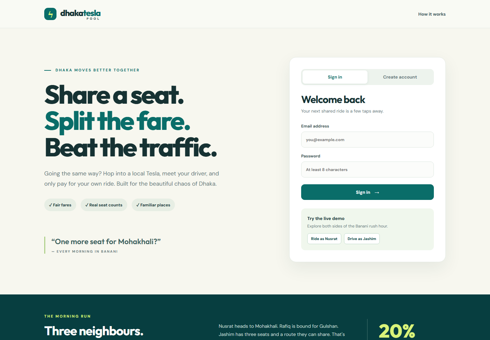
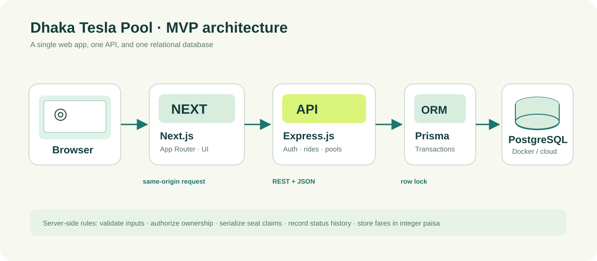
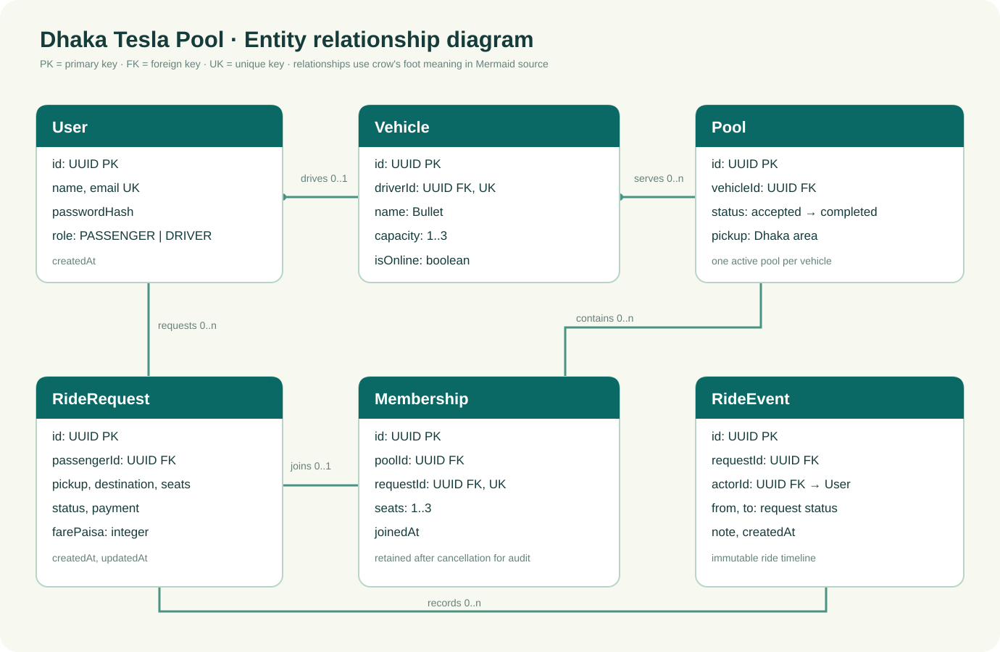

# Dhaka Tesla Pool

**Share a seat. Split the fare. Survive Dhaka traffic.** This is a ride-pooling MVP for passengers, Jashim the driver, and Bullet, his three-seat Tesla. Nusrat's Banani → Mohakhali request and Rafiq's Banani → Gulshan request can join one pool; each passenger sees only their own fare and ride history.

> **Submission status:** Code, migrations, seed data, diagrams, and local Docker setup are included. A public deployment and a recorded six-minute video require the repository owner's accounts; their links must be added before final submission. Docker could not be executed in this development environment, so run the Compose smoke check below on a machine with Docker.

## Product tour

- Passenger: choose the passenger role at signup, add a Bangladesh mobile number, sign in, choose two Dhaka areas, see a fare breakdown, request one to five seats, follow status, call the assigned driver, cancel before departure, and review the event timeline.
- Driver: choose the driver role at signup, add a Bangladesh mobile number, register a named vehicle with 3–5 passenger seats, then go online, review requests, accept compatible bookings, call assigned passengers, manage trip stages, and review history.
- Pool: one active pool per vehicle, occupied seats never above that vehicle's capacity, matching by the documented rule, fare recalculation before start, individual request status and immutable events.
- Payment: cash or **simulated** TeslaPay selection. No money is collected or wallet balance maintained.

### Screenshots and video



The architecture and ERD images below can be shown in the video. **Demo video:** record and insert your own Loom or equivalent link here before submission. Follow the timing guide in [docs/demo-video.md](docs/demo-video.md).

## Architecture





Editable Mermaid diagrams and import instructions are in [docs/diagrams.md](docs/diagrams.md). The browser calls `/api` on the Next.js origin. Next.js rewrites those requests to Express. Express performs validation, authorization, matching, fare calculation, status transitions, and transactional seat enforcement. Prisma ORM talks to PostgreSQL. The same schema works with local PostgreSQL or hosted **Prisma Postgres**; a hosted database does not replace the API.

### Why these tables exist

| Table | Purpose |
| --- | --- |
| `User` | Passenger/driver identity, role, bcrypt password hash, unique email and unique Bangladesh contact number. |
| `Vehicle` | One Tesla per driver, online status, capacity constrained to 3–5. |
| `RideRequest` | A passenger's route, seats, payment choice, status, and stored base/distance/discount/final fare components. |
| `Pool` | One driver's trip and its lifecycle; partial unique index permits one active pool per vehicle. |
| `Membership` | Explicit booking-to-pool link; retains cancelled membership for audit while excluding it from occupied seats. |
| `RideEvent` | Append-only status timeline with actor, before/after status, note, and time. |

Indexed lookup paths are pending requests by status/pickup/time, passenger history by passenger/time, pools by vehicle/status, and events by request/time. Foreign keys enforce ownership of relationships; checks enforce seat and fare ranges. Cross-row capacity is enforced by the transaction described below.

## Business rules you can calculate by hand

The demo uses predefined area coordinates, rounded straight-line grid kilometres (minimum 1 km). This is **not road routing**. For a booking of `seats` passenger seats, every amount is in integer paisa:

`baseFare = 5,000 × seats`

`distanceCharge = 1,500 × distanceKm × seats`

`poolDiscount = floor((baseFare + distanceCharge) ÷ 5)` when at least two active bookings share a pool; otherwise zero.

`passengerFare = baseFare + distanceCharge - poolDiscount`

One taka is 100 paisa. For one seat, Banani → Mohakhali is 3 km: **৳50 base + ৳45 distance − ৳19 pool discount = ৳76**. Before a second booking joins, Nusrat's fare is **৳95**. Banani → Gulshan is 4 km: Rafiq's **৳50 + ৳60 − ৳22 = ৳88** pooled, compared with **৳110** solo. The discount always lowers the fare for the **same route and seat count**; a two-seat booking can cost more in total than a one-seat booking because it reserves two seats. The UI shows both the solo estimate and potential pooled fare, then shows the discount actually applied to each ride. A third booking can claim Bullet's last seat if it fits. If a passenger cancels before start, remaining active bookings are repriced; fares freeze when the driver starts. Storing all components preserves an auditable calculation and avoids floating-point money drift.

Two bookings are compatible when they share a pickup and destination, or when both start at **Banani** and their destinations are **Mohakhali/Gulshan** in either order. This intentionally narrow corridor is enough to demonstrate overlapping routes without suggesting a real detour or route-time guarantee. Different pickups and other mixed destinations do not pool.

Request lifecycle: `REQUESTED → ACCEPTED → DRIVER_ARRIVED → STARTED → COMPLETED`; cancellation is allowed from requested, accepted, or driver-arrived. Pool lifecycle starts at accepted because a pool exists only after driver acceptance. Drivers can cancel accepted/arrived pools; neither actor can cancel after departure. Every status change writes a `RideEvent` in the same transaction.

Submitting a request only puts it in the waiting queue. The confirmation directs passengers to their ride status and does not name or promise a driver. A driver can accept only if the booking fits that vehicle's capacity; for example, Jashim's three-seat Bullet cannot accept a five-seat request.

### The last-seat race

Each accept operation takes a PostgreSQL `SELECT ... FOR UPDATE` lock on Bullet's `Vehicle` row inside a Prisma transaction, then re-reads the active pool and sums seats of non-cancelled members. Thus two concurrent claims for the last seat are serialized; the second sees the first claim and receives HTTP 409. A partial unique index also prevents two active pools for the same vehicle. Request status uses a conditional update to resolve acceptance versus unassigned cancellation. At larger scale, partition drivers geographically, retain single-writer transaction ownership per vehicle, and add idempotency keys/retries around API requests.

## Tech choices and switch points

| Choice | Why for this MVP | Alternatives / when to switch |
| --- | --- | --- |
| Next.js App Router | Clear route-based UI and a same-origin API rewrite for private cookies. | Plain React + Vite if SSR/routing needs stay minimal. |
| Express REST | Small, explicit resource endpoints and easy middleware for the few actors. | NestJS if the domain and team grow enough to justify its structure; GraphQL if clients need many different projections. |
| PostgreSQL | Transactions, row locks, checks, indexes, and relational audit history fit scarce seat allocation. | SQLite for a single-process prototype; a managed Postgres provider for production. |
| Prisma ORM 6 | Typed queries and repeatable SQL migrations, compatible with local Postgres and Prisma Postgres. | SQL/Knex for complex geospatial queries or finer control over hot paths. |
| Custom email/password + bcrypt + signed HTTP-only cookie | The brief requests first-party auth; sessions are small and browser friendly. | Managed identity if account recovery, MFA, enterprise SSO, or compliance become requirements. |
| CSS without component framework | Small bundle and direct control over accessible states/colors. | Design-system components when the UI or team grows. |
| Vitest + PostgreSQL integration suite | Checks calculations quickly, with opt-in real DB tests for transactions and permissions. | End-to-end Playwright tests after stable deployment and browser automation setup. |
| Docker Compose | Reproducible API + web + database with no paid hosting. | Separate free-tier frontend/API with hosted Prisma Postgres when reliable free hosting is available. |

## Project structure

```text
apps/api/
  prisma/schema.prisma, migrations/, seed.ts
  src/auth.ts, phone.ts, domain.ts, rides.ts, app.ts, server.ts
  src/*.test.ts
apps/web/
  src/app/page.tsx, globals.css
  src/lib/api.ts
docs/
  architecture.svg, erd.svg, diagrams.md, demo-video.md
compose.yaml, .env.example, README.md
```

These are **folders in one repository**. `master`, `pre-release`, `release/v1.0.0`, `release/v1.1.0`, and `feature/*` are Git branches, not duplicate folders. Their commit history shows the implementation steps.

## Prerequisites and environment

- Node.js 20+ and npm 10+ for host development.
- Docker Engine with Compose v2 for the full local stack, or PostgreSQL 16+ for host development.
- Copy `.env.example` to `.env` in the repository root for Compose. Replace `JWT_SECRET` with a random value of at least 32 characters and replace `POSTGRES_PASSWORD` if desired. Keep the password in the two DB URLs synchronized for host commands.
- For host API commands, also copy `.env.example` to `apps/api/.env`; Prisma CLI and `dotenv/config` resolve that file from the API workspace. Do **not** commit either `.env`.

| Variable | Purpose |
| --- | --- |
| `DATABASE_URL` | Runtime Postgres URL; use Prisma Postgres **pooled** TCP URL in a hosted environment. |
| `DIRECT_URL` | Direct Postgres URL for migrations and administration. |
| `JWT_SECRET` | Signs first-party login cookies; 32+ random characters. |
| `POSTGRES_PASSWORD` | Local Compose database password. |
| `PORT` | Express port, default 4000. |
| `WEB_ORIGIN` | Exact browser origin permitted for mutating requests, default `http://localhost:3000`. |
| `API_INTERNAL_URL` | Next.js rewrite target, default `http://localhost:4000`; Compose uses `http://api:4000`. |
| `SEED_PASSWORD` | Optional demo account password override; default is for local demo only. |

## Run with Docker

```bash
cp .env.example .env
# Edit JWT_SECRET and, if changed, POSTGRES_PASSWORD.
docker compose up --build
```

Run the command from the repository root, **`E:\telsa_internship_project`** in the provided workspace, where `compose.yaml` lives. In PowerShell use `Copy-Item .env.example .env` instead of `cp` if needed. Open **http://localhost:3000**. Compose waits for Postgres, applies all checked-in migrations, seeds the cast, starts Express, waits for `/api/health`, then starts Next.js. Stop with `docker compose down`. To remove demo data as well, `docker compose down -v` destroys the database volume; use it only when you intend to reset data. If a password changes after the volume has been initialized, reset the volume or update the database user separately.

### Host development

```bash
cp .env.example apps/api/.env
npm ci
npm run db:generate
npm run db:migrate
npm run db:seed
npm run dev
```

Run a local PostgreSQL server matching `apps/api/.env`, or start only the DB with `docker compose up -d db` after creating root `.env`. Next.js runs at `http://localhost:3000`, Express at `http://localhost:4000`, and `/api/health` verifies database connectivity. `npm run build` checks both production builds.

### Demo credentials

| Role | Email | Password |
| --- | --- | --- |
| Driver Jashim | `jashim@teslapool.test` | `DemoPass123!` |
| Passenger Nusrat | `nusrat@teslapool.test` | `DemoPass123!` |
| Passenger Rafiq | `rafiq@teslapool.test` | `DemoPass123!` |
| Passenger Shirin | `shirin@teslapool.test` | `DemoPass123!` |

The seed is idempotent. It creates Bullet online with three seats and waiting requests for Nusrat and Rafiq; Shirin can create the third request in the UI. Demo users have synthetic Bangladesh-format numbers (`+8801300000001` through `+8801300000004`); these are placeholders for UI testing, not real contacts. Change `SEED_PASSWORD` on any shared demo instance, and never seed real user accounts into a production database. Accounts created before the contact-number migration see a prompt to add their number after login; they cannot request rides or go online until they do.

### Contact numbers and visibility

Signup requires a Bangladesh mobile number such as `01712345678`; `8801712345678` and `+8801712345678` are also accepted. The API stores the canonical `+880` format and rejects an invalid or duplicate number. Signed-in users can change their own number in **Edit contact**. The driver request queue shows names without phone numbers. When a driver accepts a booking, the active pool shows that passenger's tap-to-call number and the passenger's ride shows the assigned driver's tap-to-call number. Cancelled memberships and completed pool history do not expose passenger numbers. These links open the device dialer; the app does not place calls or send SMS.

## Tests

`npm test` runs deterministic matching, fare, and lifecycle tests. The real PostgreSQL integration suite checks capacity, invalid transitions, ownership, cancellation, and simultaneous last-seat claims. Use a **disposable database whose name contains `_test`** and apply the migration first:

```bash
# Set both DATABASE_URL and TEST_DATABASE_URL to the same disposable *_test URL.
# Set DIRECT_URL to its direct URL, then:
npm run db:migrate
npm test
```

The integration suite skips itself when no matching test database is configured. It does not run against the demo or production database. **Verification completed:** both production builds passed; all 17 tests passed against a disposable local PostgreSQL 18 database, including driver registration, 5-seat capacity, concurrent claims, fare arithmetic, migration backfill, phone normalization/profile update, and assigned-contact privacy. An HTTP smoke run signed in Nusrat/Jashim and confirmed two pool members at 7,600/8,800 paisa. Docker was unavailable, so Compose startup still needs a local smoke run before submission.

## API overview

All endpoints are JSON under `/api` except 204 responses. Authentication uses an HTTP-only `tesla_session` cookie. Invalid input returns 400, unauthenticated requests 401, wrong role 403, missing/other user's ride 404, and conflicting state/capacity 409.

| Method and path | Actor | What it does |
| --- | --- | --- |
| `POST /auth/signup`, `/auth/login`, `/auth/logout` | Public | Choose passenger/driver role and provide a Bangladesh contact number at signup; a driver also provides `vehicleName` and `capacity` (3–5) and starts offline. First-party sessions. |
| `GET /me`, `PATCH /me/phone`, `GET /areas`, `GET /health` | Mixed | Identity, authenticated contact update, available zones, DB health. |
| `POST /requests/estimate` | Passenger | Solo and potential pooled price, each with base/distance/discount components. |
| `POST /requests`, `GET /requests`, `GET /requests/:id` | Passenger | Create, list, inspect own requests. |
| `POST /requests/:id/cancel` | Passenger | Cancel while valid. |
| `GET /driver/dashboard`, `PATCH /driver/online` | Driver | Request queue, pools, status, availability. |
| `POST /driver/requests/:id/accept` | Driver | Create/join pool within capacity. |
| `POST /driver/pools/:id/advance`, `/cancel` | Driver | Allowed lifecycle transitions. |

## Deployment with Prisma Postgres

Local Docker needs no cloud account. For a public demo, create a free Prisma Postgres database in the Prisma Console and copy its **pooled TCP** string into `DATABASE_URL` and **direct TCP** string into `DIRECT_URL`. [Prisma's connection guidance](https://www.prisma.io/docs/postgres/database/connecting-to-your-database) distinguishes app traffic from migrations; both URLs require SSL in the hosted service. Run `prisma migrate deploy` with the direct URL, then deploy the Express container and Next.js container to free-tier hosts that support them. Set `WEB_ORIGIN` to the exact public frontend HTTPS origin. Build Next.js with `API_INTERNAL_URL` pointing to the API's reachable HTTPS URL (or internal service URL on the same host). Keep `JWT_SECRET` and DB URLs in host secret settings. Test sign in, two pooled bookings, the last-seat conflict, and a refresh after deployment. Record the live URLs here once available.

**Deployment URL:** pending owner deployment. Free backends may sleep or free tiers may change; Docker Compose remains the reproducible deployment path. Do not pay for infrastructure just for this assessment.

## GitHub upload and required branches

The checked-in history includes `feature/passenger-auth`, `feature/tesla-pooling`, `feature/driver-flow`, `feature/passenger-ui`, `feature/driver-signup`, `feature/fare-clarity`, and `feature/contact-numbers`, merged to `master`. `pre-release` contains integration/docs/verification. `release/v1.0.0` preserves the original MVP, and `release/v1.1.0` contains role signup, fare transparency, and assigned-ride contact numbers. On GitHub, create an **empty** repository (no generated README, license, or `.gitignore`) named e.g. `dhaka-tesla-pool`, then run:

```bash
git remote add origin https://github.com/YOUR_USERNAME/dhaka-tesla-pool.git
git push -u origin master
git push origin pre-release release/v1.0.0 release/v1.1.0
git push origin feature/passenger-auth feature/tesla-pooling feature/driver-flow feature/passenger-ui feature/driver-signup feature/fare-clarity feature/contact-numbers
```

GitHub will ask for browser authentication or a credential manager; never paste a personal access token into a committed file. Set `master` as the default branch in **Settings → Default branch**, make the repository public or grant evaluator access, and verify that the branches and merge commits appear in **Branches** and **Commits**. For subsequent work: branch from `master`, commit a logical change with `feat(scope): ...` or the specified `fix/refactor/test/docs/chore/build` types, merge into `master` after checks, then cut a new pre-release and release version when ready. Do not create duplicate project folders for each branch.

## Decisions, limitations, and next work

- Zone distances and matching are intentionally schematic. No map API, detour budget, live position, or ETA is represented.
- Passenger and driver signup are first-party; email verification and password reset remain unimplemented. Add verified email/reset/MFA before public production use.
- TeslaPay is a simulated choice, not a wallet or gateway. A real payment integration needs ledger entries, webhooks, refunds, and reconciliation.
- UI refreshes every ten seconds; WebSockets or server-sent events would improve live pickup updates.
- Only one active pool per driver/vehicle and no automatic dispatch between many vehicles. Add geographic search and assignment rules when more drivers exist.
- Currency and fare are captured when the ride starts; production fares need a versioned pricing policy and dispute handling.
- A production API should add durable rate limiting, idempotency keys, structured logs, audit retention policy, monitoring, and secure credential rotation.

### If Oi Tesla goes viral

At roughly 1M passengers and 100k drivers: place stateless Next.js/API instances behind load balancers, partition matching by geography and time window, use geospatial indexes (PostGIS) for candidate search, maintain the vehicle-row transaction as the final seat claim, add bounded queues/events for notifications and analytics, use cache for non-authoritative availability, read replicas for history, WebSockets/SSE for live state, request idempotency and retry backoff, per-user/driver rate limits, tracing/metrics/logs, and DB contention monitoring. A replica or cache must never decide the final seat count. Secure services with secret management, TLS, least privilege, staged deployments, and alerting. Introduce each component only as measured load calls for it.

## AI usage

**Tool:** OpenAI Codex was used to draft the implementation, diagrams, README, and tests and to review build/test results. **Accepted suggestion:** lock the vehicle row in a PostgreSQL transaction so concurrent seat claims serialize. **Changed suggestion:** avoid a map service and broad route matching; the PRD values explainable matching, so this MVP uses explicit Banani corridor compatibility and a hand-checkable grid fare. The repository owner should run Docker, review the code, and be able to explain or modify each choice in the demo/interview.

The assignment source is `Dhaka_Tesla_Pool_PRD_Internship.pdf` (kept outside Git history). No private credentials or deployment URL are embedded in source.
