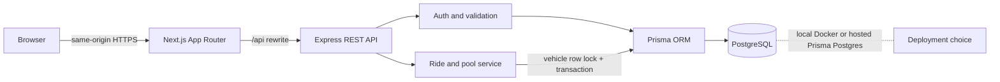
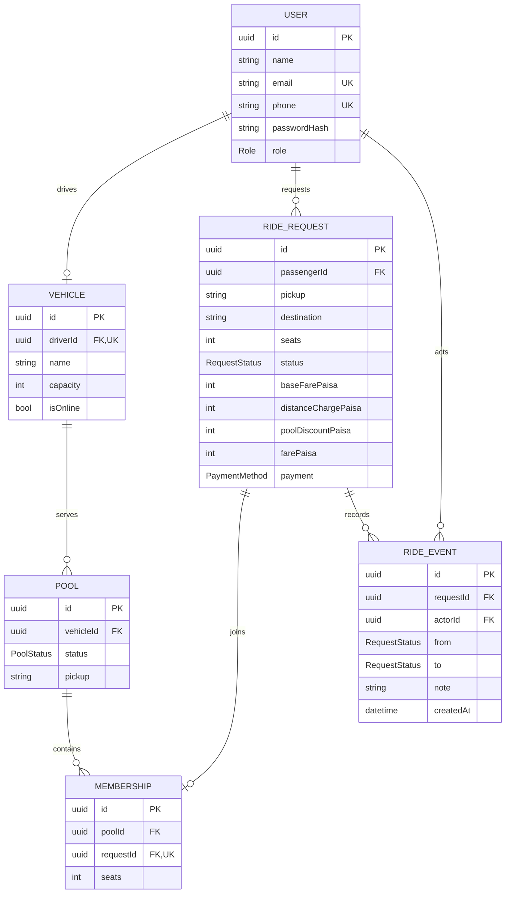

# Diagrams

The SVG files in this folder are ready to insert into a video, slide, README, or draw.io. The Mermaid source below is editable in [Mermaid Live](https://mermaid.live/); diagrams.net also imports Mermaid via **Arrange → Insert → Advanced → Mermaid**.

## Architecture

## Entity relationship diagram

